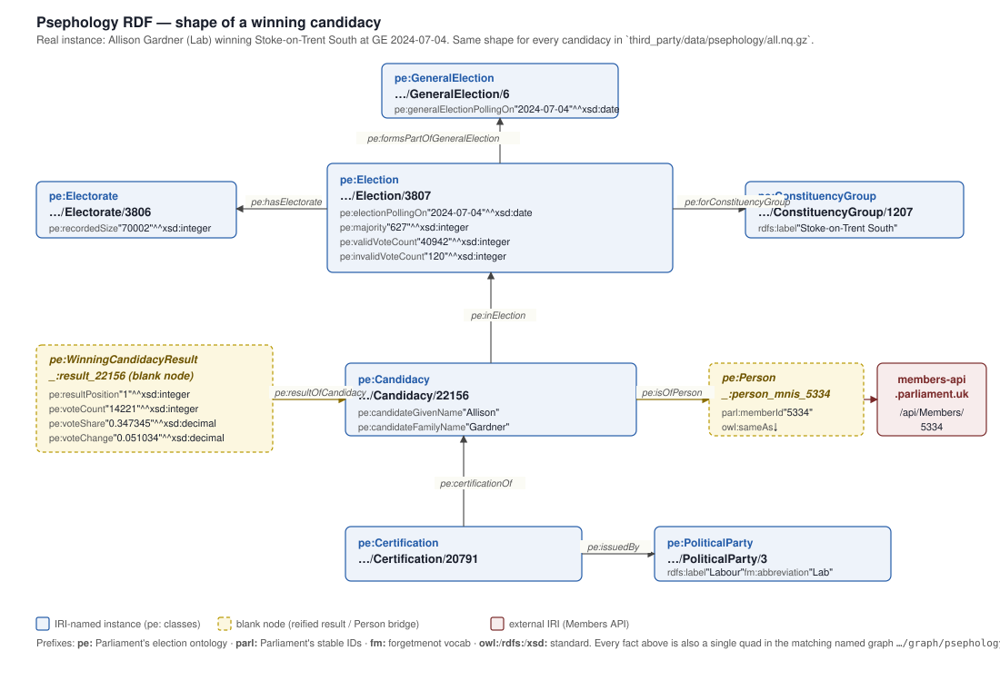

# Psephology RDF — the shape of an instance, on one page

The committed dump at
[`third_party/data/psephology/all.nq.gz`](../../third_party/data/psephology/all.nq.gz)
holds **420,158 N-Quads** describing the House of Commons Library's
election-results database under Parliament's published
[election ontology](https://ukparliament.github.io/ontologies/election/election-ontology.html)
(`pe:`). Rather than read the schema, read the picture:



The diagram is **one real winning candidacy** — Allison Gardner
(Labour), Stoke-on-Trent South, at the general election of
4 July 2024 — with every triple drawn out. Every other candidacy
in the dump has the same shape; only the literals change. The same
shape minus `pe:WinningCandidacyResult` and minus `pe:isOfPerson`
describes a losing candidacy.

## How to read this

| Visual | Meaning |
|---|---|
| Blue solid box | IRI-named `pe:` instance (`…/Election/3807`). Stable; you can dereference it. |
| Cream dashed box | Blank node (`_:result_22156`, `_:person_mnis_5334`). Local to this graph; not a global identifier. |
| Red box | External IRI (Members API URL `https://members-api.parliament.uk/api/Members/5334`). The bridge into the rest of the forgetmenot data. |
| Labelled arrow | One predicate. Each edge in the picture is one (s, p, o) triple in the quad file. |

The dump uses **one named graph per source table** —
`…/graph/psephology/elections`, `…/candidacies`, `…/certifications`,
`…/members-bridge`, and so on. So the candidacy box, the result
blank node, and the Person blank node all live in the same
`…/candidacies` graph; the Election lives in `…/elections`; the
Certification lives in `…/certifications`. A 19th graph,
`…/provenance`, describes each of the others with PROV-O and
points at the upstream `db/dumps/2026-05-23.sql` URL.

## Same nine triples, in N-Quads

The diagram and the quads below are the same facts:

```nquads
# pe:GeneralElection
<…/GeneralElection/6> a pe:GeneralElection ;
  pe:generalElectionPollingOn "2024-07-04"^^xsd:date .

# pe:Election (the constituency contest)
<…/Election/3807> a pe:Election ;
  pe:electionPollingOn         "2024-07-04"^^xsd:date ;
  pe:majority                  "627"^^xsd:integer ;
  pe:validVoteCount            "40942"^^xsd:integer ;
  pe:invalidVoteCount          "120"^^xsd:integer ;
  pe:formsPartOfGeneralElection <…/GeneralElection/6> ;
  pe:forConstituencyGroup       <…/ConstituencyGroup/1207> ;
  pe:hasElectorate              <…/Electorate/3806> .

<…/ConstituencyGroup/1207> a pe:ConstituencyGroup ;
  rdfs:label "Stoke-on-Trent South" .

<…/Electorate/3806> a pe:Electorate ;
  pe:recordedSize "70002"^^xsd:integer .

# pe:Candidacy + reified result
<…/Candidacy/22156> a pe:Candidacy ;
  pe:candidateGivenName  "Allison" ;
  pe:candidateFamilyName "Gardner" ;
  pe:inElection          <…/Election/3807> ;
  pe:isOfPerson          _:person_mnis_5334 .

_:result_22156 a pe:WinningCandidacyResult ;
  pe:resultOfCandidacy <…/Candidacy/22156> ;
  pe:resultPosition    "1"^^xsd:integer ;
  pe:voteCount         "14221"^^xsd:integer ;
  pe:voteShare         "0.347345"^^xsd:decimal ;
  pe:voteChange        "0.051034"^^xsd:decimal .

# Bridge to Members API / identity graph
_:person_mnis_5334 a pe:Person ;
  parl:memberId "5334"^^xsd:integer ;
  owl:sameAs    <https://members-api.parliament.uk/api/Members/5334> .

# Certification (which party fielded which candidate)
<…/Certification/20791> a pe:Certification ;
  pe:certificationOf <…/Candidacy/22156> ;
  pe:issuedBy        <…/PoliticalParty/3> .

<…/PoliticalParty/3> a pe:PoliticalParty ;
  rdfs:label       "Labour" ;
  fm:abbreviation  "Lab" .
```

## How many instances of each class actually exist

(from the 2026-05-23 dump; counted by `parl psephology sql …`)

| Class | Instances |
|---|---:|
| `pe:Country` | 6 |
| `pe:ParliamentPeriod` | 59 |
| `pe:BoundarySet` | 35 |
| `pe:ConstituencyGroupSet` | 35 |
| `pe:ConstituencyGroup` | 1,959 |
| `pe:ConstituencyArea` | 1,959 |
| `pe:StatutoryThing` (Acts/Orders) | 79 |
| `pe:PoliticalParty` | 324 |
| `pe:PoliticalPartyRegistration` | 376 |
| `pe:GeneralElection` | 7 |
| `pe:Election` (one row per constituency × polling day) | 4,552 |
| `pe:Electorate` | 4,554 |
| `pe:Candidacy` | 26,372 |
| `pe:Certification` | 24,524 |
| `pe:Person` (bridged via `members.mnis_id`) | 1,547 |

There is no `pe:Person` row in Postgres — Person is reified from
the `members` table at RDFification time, keyed on `mnis_id`
(the Members API id) so a single query can join psephology to
the [identity graph](../../../third_party/identity-graph/) and
through it to MNIS, DDP, the per-MP website crawl, APPG roles,
and the GOV.UK people factoid corpus.

## Where to go from here

- The full table-to-predicate mapping (every column on every
  table) is in [`reference.md`](reference.md).
- The dump itself: `zcat third_party/data/psephology/all.nq.gz`.
- Rebuild from the source DB:
  ```
  npm run psephology:up
  npm run psephology:rdf
  ```
- All `fm:` predicates emitted alongside the `pe:` ones are
  declared in
  [`third_party/data/psephology/fm-vocab.ttl`](../../third_party/data/psephology/fm-vocab.ttl)
  per the project vocab discipline in
  [`docs/vocab.md`](../../docs/vocab.md).
